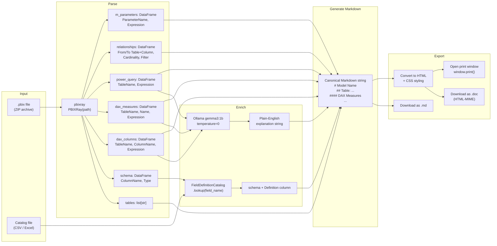
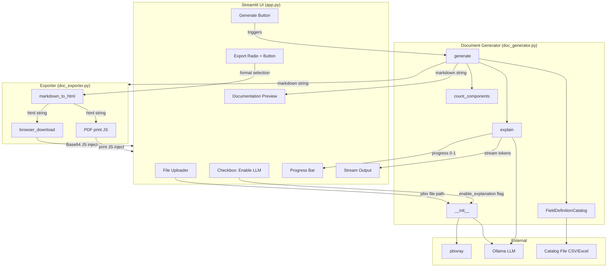

# Architecture

## System Design Narrative

PBIX Documenter is structured as a three-layer pipeline: extract, enrich, and export.

The **extraction layer** uses `pbixray` to parse a `.pbix` file (which is a ZIP archive) and produce structured DataFrames for every component of the semantic model: tables, schema columns, DAX calculated columns, DAX measures, Power Query (M) scripts, relationships, and M parameters.

The **enrichment layer** optionally joins two sources of additional context onto the raw extraction output. First, a field definition catalog (CSV or Excel) maps column names to business-friendly descriptions -- these are injected into the schema table at generation time. Second, an LLM (Ollama) generates plain-English explanations for each DAX expression and Power Query script. Both enrichment steps are optional and gracefully skipped if unavailable.

The **export layer** takes the single canonical Markdown string produced by the generator and converts it to any of four output formats: Markdown, HTML, Word (HTML-MIME), or PDF (browser print). All conversion logic lives in `MarkdownExporter` and has no dependency on the generation pipeline.

---

## Data Flow Walkthrough



The flow above maps directly to the execution sequence in `generate()`:

1. User uploads a .pbix file via the Streamlit sidebar.

2. `app.py` writes the file to a local temp directory and instantiates `PBIDocumentGenerator` with the file path and callback functions.

3. `PBIDocumentGenerator.__init__`:
   - Loads the PBIX model via `PBIXRay(pbix_path)`
   - Initialises the Ollama LLM client (gemma3:1b, temperature=0)
   - Stores callback references for progress, scratch, and stream output

4. `PBIDocumentGenerator.generate()` is called:
   - `count_components()` -- counts total DAX columns + DAX measures + Power Query steps to establish the progress denominator
   - `FieldDefinitionCatalog.load()` -- reads the catalog file and returns a lookup function keyed on column name
   - Schema enrichment -- applies the lookup function to every row of the full schema DataFrame, precomputing all definitions upfront
   - For each table in the model: emits M Query, Relationships, Schema fields, Calculated Columns, and DAX Measures as fenced Markdown blocks, calling `_explain()` for each expression if enabled
   - `_explain()` streams LLM tokens to the UI via `stream_callback`, normalises smart quotes in the response, and returns the full explanation string

5. `generate()` returns a single Markdown string (`mdata`).

6. `app.py` stores `mdata` in session state and renders it via `st.markdown()`.

7. `MarkdownExporter` is instantiated with `mdata` and the model name.

8. On export button click:
   - Markdown: `browser_download(mdata, filename, "text/markdown")`
   - HTML: `markdown_to_html(mdata)` then `browser_download()`
   - Word: same HTML content, MIME type `"application/msword"`
   - PDF: injects HTML + JS into an `st.components` iframe; JS opens a print window and triggers `window.print()`

---

## Component Interface Contracts



### PBIDocumentGenerator

```python
PBIDocumentGenerator(
    pbix_path: str,                          # Path to the .pbix file on disk
    enable_explanation: bool,                # Whether to call Ollama for DAX/M explanations
    catalog_path: str | None,                # Path to field definition catalog (CSV or Excel)
    catalog_primary_key: str,                # Column to match against model field names
    catalog_fallback_key: str,               # Secondary match column (e.g. source system name)
    catalog_definition_columns: list[str],   # Ordered list of definition columns to try
    scratch_callback: Callable[[str], None], # Shows current item label in UI
    clear_scratch_callback: Callable[[], None],  # Clears the label
    progress_callback: Callable[[float], None],  # Updates progress bar (0.0-1.0)
    stream_callback: Callable[[Generator], None] # Consumes LLM token stream
)

.generate() -> str   # Returns full Markdown document string
```

### FieldDefinitionCatalog

```python
FieldDefinitionCatalog(
    catalog_path: str,            # Path to CSV or Excel catalog file
    primary_key_column: str,      # Column to match against model field names
    fallback_key_column: str,     # Secondary match column (e.g. source system name)
    definition_columns: list[str] # Ordered list of definition columns to try
)

.load() -> Callable[[str], str]  # Returns memoized lookup: field_name -> definition string
```

### MarkdownExporter

```python
MarkdownExporter(
    data: str,           # Canonical Markdown string
    output_path: str,    # Temp directory path
    model_name: str      # Used as the base filename for downloads
)

.export(type: Literal["Markdown", "HTML", "Word", "PDF"]) -> None
# Triggers browser-side download; no return value
```

---

## Scalability and Reliability Considerations

**File size:** `pbixray` loads the entire PBIX into memory. For very large models (100+ tables, thousands of measures), memory pressure may be noticeable. The current design is appropriate for typical enterprise report files (under 500MB). For very large files, a streaming extraction approach would be needed.

**LLM latency:** Ollama inference on a CPU is slow for large models. The progress bar and streaming output mitigate perceived latency, but a model with 200+ DAX measures may take several minutes to fully document with explanations enabled. A future optimisation would be to batch or parallelise LLM calls.

**Concurrency:** Streamlit's default server handles one session per browser tab. The temp directory approach (writing the PBIX to disk before parsing) creates a potential collision if two users upload files simultaneously with the same filename. A production deployment should namespace temp files by session ID.

**LLM reliability:** If Ollama is not running, `_explain()` will raise a connection error. The recommended production pattern is to wrap the LLM call in a try/except at the `_explain` method level, log the failure, and return an empty string -- preserving the rest of the document and giving the user a clear error message rather than a hard stop.

**Export fidelity:** The Word export uses HTML-MIME rather than the native `.docx` format. This works in most versions of Microsoft Word but may produce rendering differences. The `python-docx` library was evaluated as a more faithful alternative but added significant complexity for marginal gain given stakeholder usage patterns.

---

## Alternatives Considered

### Cloud LLM API vs. Local Ollama
A hosted LLM API (OpenAI, Anthropic) would offer faster inference and more capable models. It was rejected because: (1) it requires sending potentially sensitive report schema data to an external service, (2) per-call costs accumulate for a self-serve internal tool with unpredictable usage, and (3) it creates a hard dependency on network availability and API key management.

### Dedicated per-format generation vs. Markdown-first
An alternative design would have the generator write directly to a Word document (via `python-docx`) or HTML, treating each format as a first-class output. This was rejected because it would have required maintaining parallel generation paths, and any change to the content structure (e.g. adding a new section) would need to be replicated across all format writers. Markdown as an intermediate format isolates content decisions from presentation decisions.

### Server-side file generation vs. Client-side download
An alternative would write the exported file to the server filesystem and serve it via a download link. This was rejected because it introduces file lifecycle management complexity (cleanup, collision avoidance, permissions) in a single-user Streamlit deployment. Browser-side download via Base64 and JavaScript is simpler and leaves no server-side artifacts.

### Polling-based progress vs. Callback-based streaming
A polling approach would have the UI check generation status on a timer. The callback approach was chosen because it gives sub-second feedback without any artificial delay, and it decouples the generator from the UI framework -- the same generator code can be used in a CLI context by passing no-op callbacks.
