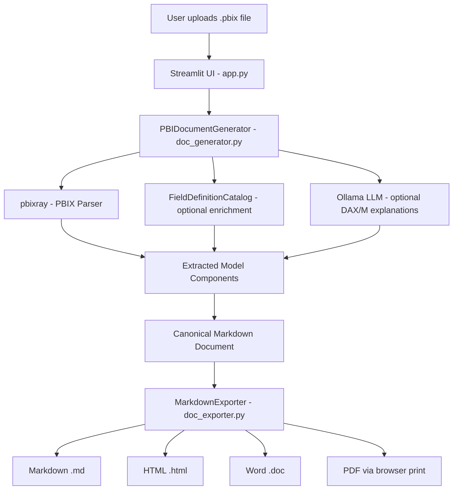

# PBIX Documenter

A self-serve Streamlit app that auto-generates documentation for Power BI semantic models (.pbix files). Extracts tables, DAX measures, Power Query scripts, and relationships, with optional local LLM inference via Ollama for plain-English code explanations. Exports to Markdown, HTML, Word, and PDF.


---

## About This Repository

I built and deployed the production version of this system in an enterprise environment. This repository is a sanitized reference implementation -- it reflects the real architecture, design decisions, and engineering patterns, with proprietary business logic replaced by clean stubs and generalizations.

For questions about the production implementation or design decisions, feel free to connect on LinkedIn: linkedin.com/in/kamal-manick

---

## Problem Statement

Power BI reports accumulate significant hidden complexity in their semantic layer: calculated columns, DAX measures, Power Query transformations, and cross-table relationships. This complexity is invisible to stakeholders and costly to reverse-engineer during audits, handovers, or governance reviews.

Existing documentation approaches are manual, inconsistent, and quickly go stale. PBIX Documenter solves this by treating the `.pbix` file itself as the source of truth -- extracting the full semantic model programmatically and rendering it as structured, human-readable documentation in seconds.

---

## Architecture Overview



---

## Key Design Decisions

### 1. Markdown as the universal intermediate format
The user-facing requirement was documentation in Word and PDF formats for stakeholder distribution. Rather than building separate generation paths for each output format, the system generates one canonical Markdown document. All exporters are pure format transformers on top of it. This kept generation logic simple and isolated: adding a new export format means writing one converter, not touching the core engine.

### 2. Local LLM inference via Ollama
DAX and Power Query (M) explanations are generated by a locally hosted LLM (Ollama). This eliminates cloud API costs, keeps potentially sensitive report data off external services, and allows the tool to run fully offline. The model runs at temperature=0 for deterministic, reproducible explanations.

### 3. Callback-driven streaming for real-time UI feedback
The generation engine is decoupled from the UI via three callback types: progress (numeric 0-1), scratch (current item label), and stream (LLM token stream). This means the UI updates in real time without polling, and the generator can be used headlessly or with a different frontend by swapping callback implementations.

### 4. Component counting for accurate progress tracking
Before generation begins, the engine counts the total number of DAX measures, calculated columns, and Power Query steps across the model. This gives a deterministic denominator for the progress bar -- no fake loading spinners, just an honest percentage derived from the actual workload.

### 5. Field definition catalog as an enrichment layer
Business-friendly field definitions can be loaded from an external catalog file (CSV or Excel) and injected into the schema table during documentation generation. The catalog integration is an optional enrichment step: if no catalog is provided or a field has no match, the documentation generates cleanly without it. See `src/doc_generator.py` and `sample_catalog.csv` for the interface contract.

---

## Setup and Installation

### Prerequisites

**1. Python 3.12+**

**2. Ollama** -- required for DAX/M explanations (optional feature)

Install from [ollama.com](https://ollama.com), then pull the model:

```bash
ollama pull gemma3:1b
```

Ollama must be running in the background when you use the "Include DAX/M Explanation" option. If you skip this step, the app works fine -- it just generates documentation without LLM explanations.

---

### Installation

**Option A: uv (recommended)**

[uv](https://docs.astral.sh/uv/) is a fast Python package manager. Install it once, then:

```bash
git clone https://github.com/kamal-manick/pbix-documenter.git
cd pbix-documenter

uv venv
uv pip install -r requirements.txt
```

Activate the environment and run:

```bash
# macOS / Linux
source .venv/bin/activate
streamlit run src/app.py

# Windows
.venv\Scripts\activate
streamlit run src/app.py
```

**Option B: uvx (temporary environment, no activation needed)**

If you just want to try it without managing a persistent environment:

```bash
git clone https://github.com/kamal-manick/pbix-documenter.git
cd pbix-documenter
uvx --with-requirements requirements.txt streamlit run src/app.py
```

**Option C: pip**

```bash
git clone https://github.com/kamal-manick/pbix-documenter.git
cd pbix-documenter

python -m venv .venv
source .venv/bin/activate   # Windows: .venv\Scripts\activate
pip install -r requirements.txt
streamlit run src/app.py
```

---

### Quick Test (no Streamlit)

To explore the core pattern against a real PBIX file without running the full app, use the notebook:

```bash
jupyter notebook notebooks/quickstart.ipynb
```

This downloads a sample PBIX file from Microsoft's public repository and runs the full documentation pipeline headlessly. See [notebooks/](notebooks/) for details.

---

## Component Breakdown

| Component | File | Responsibility |
|---|---|---|
| Web UI | `src/app.py` | Streamlit interface, session state, 3-step workflow |
| Document Generator | `src/doc_generator.py` | PBIX parsing, model extraction, Markdown generation, LLM integration |
| Field Catalog | `src/doc_generator.py` (`FieldDefinitionCatalog`) | Optional enrichment of schema fields with business definitions |
| Exporter | `src/doc_exporter.py` | Format conversion and browser-side file download |
| Sample Catalog | `sample_catalog.csv` | Reference schema for the field definition catalog interface |

---

## Tech Stack

| Layer | Technology | Notes |
|---|---|---|
| Web framework | Streamlit | Session state, streaming UI, sidebar layout |
| PBIX parsing | pbixray | Extracts semantic model from .pbix zip structure |
| LLM integration | LangChain + langchain-ollama | Prompt construction and streaming |
| Local inference | Ollama (gemma3:1b) | Runs fully offline, no cloud API required |
| Data processing | Pandas | DataFrame operations for model components |
| Markdown rendering | markdown2 | Markdown-to-HTML conversion with table support |
| Export delivery | Browser JavaScript / Base64 | Client-side download, no server file persistence |
| Catalog loading | openpyxl / csv | Field definition enrichment from external catalog |
| Python | 3.12 | |

---

## What I Would Build Next

- **Snowflake Semantic View / Cortex Analyst YAML export** -- generate a specification YAML from the documented model that can be imported directly into Snowflake as a Semantic View or used with Cortex Analyst (AI Agent) for natural language querying
- **Incremental documentation** -- diff two versions of a PBIX file and generate a changelog highlighting added, modified, or removed measures and tables
- **CI/CD integration** -- a headless CLI mode so documentation can be regenerated automatically when a PBIX file is committed to a repository
- **Catalog auto-population** -- after first-pass documentation, prompt the LLM to suggest business definitions for undocumented fields and write them back to the catalog

---

## Learnings and Reflection

**On the value of local inference:** Running Ollama locally removed the biggest adoption blocker for an internal tool -- the concern about sending report data to an external API. It also made the cost model trivial: zero per-call cost, no rate limits, and no dependency on network availability.

**On Markdown-first design:** The decision to treat Markdown as the single canonical output format, with all other formats derived from it, paid off immediately. The HTML, Word, and PDF exporters each took a fraction of the time they would have required with dedicated generation paths.

**On streaming UX:** Streaming LLM output token-by-token to the UI made a slow operation feel fast and gave users confidence that the system was working. The callback abstraction made this easy to layer in without changing the generation logic.

**On the complexity of the semantic layer:** Power BI's semantic layer holds more engineering logic than most teams realise. DAX measures can encode complex business rules, Power Query scripts can contain multi-step ETL pipelines, and relationship configurations carry assumptions about data grain. Surfacing all of this in structured documentation is genuinely useful for governance, handovers, and audits.
