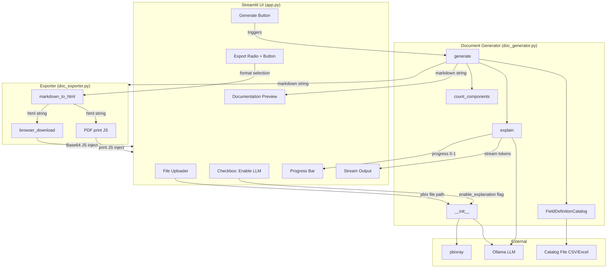

# Component Interaction Diagram

Shows the internal components of PBIX Documenter and how they interact.

```mermaid
graph TD
    subgraph UI["Streamlit UI (app.py)"]
        UP[File Uploader]
        CB[Checkbox: Enable LLM]
        BTN[Generate Button]
        PROG[Progress Bar]
        STRM[Stream Output]
        PREV[Documentation Preview]
        EXP[Export Radio + Button]
    end

    subgraph GEN["Document Generator (doc_generator.py)"]
        INIT[__init__]
        COUNT[count_components]
        CATALOG[FieldDefinitionCatalog]
        EXPLAIN[explain]
        GENERATE[generate]
    end

    subgraph EXPORT["Exporter (doc_exporter.py)"]
        M2H[markdown_to_html]
        DL[browser_download]
        PDF[PDF print JS]
    end

    subgraph EXT["External"]
        PBIXRAY[pbixray]
        OLLAMA[Ollama LLM]
        CATFILE[Catalog File CSV/Excel]
    end

    UP -->|pbix file path| INIT
    CB -->|enable_explanation flag| INIT
    BTN -->|triggers| GENERATE

    INIT --> PBIXRAY
    INIT --> OLLAMA

    GENERATE --> COUNT
    GENERATE --> CATALOG
    CATALOG --> CATFILE
    GENERATE --> EXPLAIN
    EXPLAIN --> OLLAMA
    EXPLAIN -->|stream tokens| STRM
    EXPLAIN -->|progress 0-1| PROG

    GENERATE -->|markdown string| PREV
    GENERATE -->|markdown string| EXPORT

    EXP -->|format selection| M2H
    M2H -->|html string| DL
    M2H -->|html string| PDF
    DL -->|Base64 JS inject| UI
    PDF -->|print JS inject| UI
```
