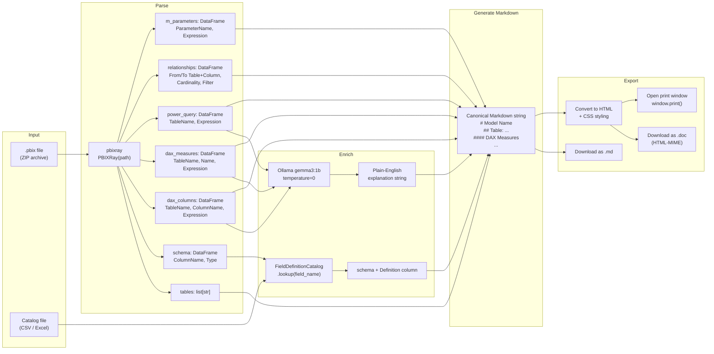

# Data Flow Diagram

Shows how data moves through the system from PBIX file input to documentation output.

```mermaid
flowchart LR
    subgraph INPUT["Input"]
        PBIX[".pbix file\n(ZIP archive)"]
        CATF["Catalog file\n(CSV / Excel)"]
    end

    subgraph PARSE["Parse"]
        PBIXRAY["pbixray\nPBIXRay(path)"]
        TABLES["tables: list[str]"]
        SCHEMA["schema: DataFrame\nColumnName, Type"]
        DAX_COL["dax_columns: DataFrame\nTableName, ColumnName, Expression"]
        DAX_M["dax_measures: DataFrame\nTableName, Name, Expression"]
        PQ["power_query: DataFrame\nTableName, Expression"]
        RELS["relationships: DataFrame\nFrom/To Table+Column,\nCardinality, Filter"]
        PARAMS["m_parameters: DataFrame\nParameterName, Expression"]
    end

    subgraph ENRICH["Enrich"]
        LOOKUP["FieldDefinitionCatalog\n.lookup(field_name)"]
        SCHEMA_E["schema + Definition column"]
        LLM["Ollama gemma3:1b\ntemperature=0"]
        EXPLAIN["Plain-English\nexplanation string"]
    end

    subgraph GENERATE["Generate Markdown"]
        MD["Canonical Markdown string\n# Model Name\n## Table: ...\n#### DAX Measures\n..."]
    end

    subgraph EXPORT["Export"]
        RAW["Download as .md"]
        HTML["Convert to HTML\n+ CSS styling"]
        WORD["Download as .doc\n(HTML-MIME)"]
        PDF["Open print window\nwindow.print()"]
    end

    PBIX --> PBIXRAY
    PBIXRAY --> TABLES & SCHEMA & DAX_COL & DAX_M & PQ & RELS & PARAMS

    CATF --> LOOKUP
    SCHEMA --> LOOKUP
    LOOKUP --> SCHEMA_E

    DAX_COL & DAX_M & PQ --> LLM
    LLM --> EXPLAIN

    TABLES & SCHEMA_E & DAX_COL & DAX_M & PQ & RELS & PARAMS & EXPLAIN --> MD

    MD --> RAW
    MD --> HTML --> WORD
    HTML --> PDF
```
