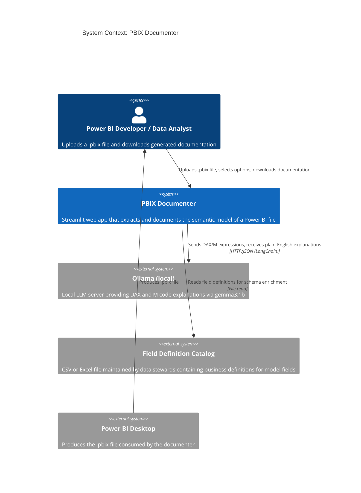

# System Context Diagram

Shows how PBIX Documenter sits within its broader environment -- the actors and external systems it interacts with.

```mermaid
C4Context
    title System Context: PBIX Documenter

    Person(user, "Power BI Developer / Data Analyst", "Uploads a .pbix file and downloads generated documentation")

    System(pbixdoc, "PBIX Documenter", "Streamlit web app that extracts and documents the semantic model of a Power BI file")

    System_Ext(ollama, "Ollama (local)", "Local LLM server providing DAX and M code explanations via gemma3:1b")

    System_Ext(catalog, "Field Definition Catalog", "CSV or Excel file maintained by data stewards containing business definitions for model fields")

    System_Ext(pbix, "Power BI Desktop", "Produces the .pbix file consumed by the documenter")

    Rel(user, pbixdoc, "Uploads .pbix file, selects options, downloads documentation")
    Rel(pbixdoc, ollama, "Sends DAX/M expressions, receives plain-English explanations", "HTTP/JSON (LangChain)")
    Rel(pbixdoc, catalog, "Reads field definitions for schema enrichment", "File read")
    Rel(pbix, user, "Produces .pbix file")
```
